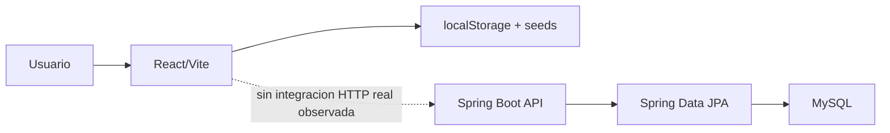

# Analisis integral de arquitectura - Econexus

Fecha de revision: 2026-05-29  
Workspace revisado: `ProyectoFinal`  
Alcance: frontend React/Vite, backend Spring Boot, base de datos SQL, documentacion local y trazabilidad Jira disponible en README.

## 1. Resumen ejecutivo

Econexus esta dividido en dos aplicaciones:

- `Econexus_Frontend/Econexus`: aplicacion React + Vite con interfaz publica, login, dashboard y modulos privados.
- `Econexus-Backend`: API REST Spring Boot + Java 17 + JPA + MySQL.

La arquitectura declarada en el README del backend apunta a un sistema empresarial con autenticacion JWT, RBAC, CRUDs completos, dashboard, busqueda global y persistencia MySQL. Sin embargo, la implementacion real esta en un estado mixto:

- El frontend compila y ofrece una experiencia funcional, pero opera casi totalmente con `localStorage` y datos seed.
- El backend tiene una base correcta por capas, DTOs, mappers, repositorios y algunos CRUDs, pero no implementa aun autenticacion real, JWT, usuarios, dashboard ni busqueda global.
- No existe integracion real frontend-backend: no se encontraron llamadas `fetch`/`axios` hacia la API.
- La seguridad esta desactivada a nivel backend porque todas las rutas estan en `permitAll`.
- El README y el backlog/Jira documentado prometen mas alcance del que el codigo actual soporta.

Veredicto arquitectonico: el sistema es una buena maqueta/prototipo funcional y tiene una base backend razonable, pero todavia no esta listo como sistema integrado ni como entrega productiva segura.

## 2. Inventario tecnico

### Frontend

- Framework: React 19.2.4.
- Bundler: Vite 8.0.4/8.0.8.
- Ruteo: `react-router-dom` 7.14.1.
- Graficas: `recharts` 3.8.1.
- UI base: Bootstrap 5.3.3 y Bootstrap Icons desde CDN.
- Persistencia actual: `localStorage`.
- Scripts disponibles: `dev`, `build`, `lint`, `preview`.

### Backend

- Framework: Spring Boot 3.2.5.
- Lenguaje: Java 17.
- Persistencia: Spring Data JPA + MySQL.
- Documentacion API: SpringDoc OpenAPI.
- Seguridad declarada: Spring Security + JWT.
- Seguridad implementada: Spring Security presente, pero sin proteccion efectiva.
- Build: Maven Wrapper presente, pero no ejecuta correctamente en este workspace.

### Base de datos

El script `saneamiento_ambiental.sql` define 7 tablas principales:

- `usuarios`
- `clientes`
- `tipos_servicio`
- `proveedores`
- `ordenes_servicio`
- `reportes`
- `normativas`

El modelo SQL es coherente con el dominio general: clientes contratan ordenes, ordenes generan reportes, tipos de servicio clasifican proveedores/ordenes/reportes y normativas viven como catalogo legal.

## 3. Arquitectura actual observada

La arquitectura implementada no corresponde todavia a la arquitectura objetivo documentada. En la practica, frontend y backend funcionan como dos piezas independientes.

## 4. Analisis del frontend

### Fortalezas

- Tiene una estructura clara por modulos: clientes, proveedores, ventas, usuarios, normativas, reportes, dashboard, layout y autenticacion.
- La experiencia visual esta bastante avanzada: hay layout publico, layout privado, sidebar, topbar, modales, tablas, KPIs y graficas.
- El build de produccion fue exitoso con `npm run build`.
- El uso de componentes por modulo facilita migrar progresivamente de `localStorage` a API real.
- El ruteo esta separado entre paginas publicas y privadas.

### Debilidades criticas

1. La autenticacion es solo local.

El login valida usuarios desde `localStorage`/seeds y guarda `eco_authenticated` y `eco_current_user`. Esto permite modificar el rol o marcarse autenticado desde DevTools.

Impacto: cualquier control de acceso frontend es facilmente manipulable.

2. No consume el backend.

No se encontraron llamadas `fetch` ni `axios`. Los modulos de negocio persisten en `localStorage`, por ejemplo clientes en `eco_clientes_v2`, ventas en `eco_ventas_v2` y reportes en `eco_reportes_v3`.

Impacto: los datos no son multiusuario, no son auditables, no se sincronizan y se pierden/alteran por navegador.

3. Inconsistencia de claves de almacenamiento.

El dashboard usa `eco_ventas`, `eco_clientes`, `eco_reportes`, mientras otros modulos usan `eco_ventas_v2`, `eco_clientes_v2`, `eco_reportes_v3`.

Impacto: los KPIs pueden mostrar datos distintos a los modulos operativos.

4. El lint falla.

Resultado de `npm run lint`: 20 errores y 1 warning. Hay errores por variables no usadas, bloques catch vacios, hooks condicionales y reglas nuevas de React Hooks.

Impacto: deuda de calidad y riesgo de errores en renderizados/modales.

5. Bundle grande.

El build genera `index-C2Q47KAS.js` de 754.62 kB minificado, con advertencia de chunk > 500 kB.

Impacto: carga inicial mas pesada, especialmente en conexiones lentas.

### Observaciones por modulo frontend

- Login: funcional como demo, pero no seguro.
- ProtectedRoute: controla roles desde `localStorage`; util para UI, no para seguridad.
- Clientes/Proveedores/Ventas/Reportes/Usuarios: CRUDs locales bien presentados, pero sin persistencia central.
- Dashboard: visualmente util, pero sus fuentes de datos no coinciden con algunos modulos.
- TopBar: implementa busqueda global local, alineada con la idea de busqueda, pero no con endpoint backend.

## 5. Analisis del backend

### Fortalezas

- Buena separacion por capas: controller, service, repository, mapper, dto, model, exception, config.
- Uso adecuado de DTOs para evitar exponer entidades directamente.
- Validacion con `jakarta.validation` en requests.
- Manejo global de errores con `@RestControllerAdvice`.
- Transacciones declaradas en servicios.
- Modelo relacional de dominio razonable.
- Eliminacion logica/anulacion presente en proveedores y ordenes.
- Swagger/OpenAPI configurado parcialmente.

### Debilidades criticas

1. Seguridad desactivada.

`SecurityConfig` contiene `.anyRequest().permitAll()`. Esto contradice el README, que declara JWT, tokens por request y proteccion por roles.

Impacto: todos los endpoints quedan publicos.

2. JWT no implementado.

Existen dependencias `jjwt`, pero no se encontraron clases de autenticacion, filtro JWT, token provider, `UserDetailsService`, endpoint `/api/auth/login` ni validacion de token.

Impacto: las historias HU-A01, HU-A02 y HU-A03 no estan completas.

3. Usuarios no implementados en backend.

La base de datos define tabla `usuarios`, pero no se encontro entidad `Usuario`, repository, service ni controller.

Impacto: no hay administracion real de usuarios ni passwords con BCrypt.

4. CRUDs incompletos frente al README.

Implementacion observada:

- Clientes: listar, crear, buscar. Faltan editar y eliminar.
- Tipos de servicio: listar, crear. Faltan editar y eliminar.
- Normativas: listar vigentes, crear. Faltan editar y eliminar.
- Proveedores: CRUD completo con baja logica.
- Ordenes: CRUD/anulacion completo, pero endpoint real es `/api/ordenes-servicio`, no `/api/ordenes`.
- Reportes: CRUD completo.

5. Riesgo de error en generacion de numero de orden.

La secuencia se calcula buscando el maximo numero por patron y sumando 1 en memoria. En concurrencia, dos requests simultaneas pueden generar el mismo numero.

Impacto: colision por constraint unique y error intermitente.

6. `ddl-auto: update` en configuracion.

Esto es aceptable en desarrollo, pero riesgoso en entornos productivos.

Impacto: cambios de entidades pueden alterar el esquema sin control de migraciones.

7. `show-sql: true` habilitado.

Puede exponer informacion sensible en logs y aumentar ruido/costo.

8. Secret JWT por defecto en `application.yml`.

Aunque no se usa aun, dejar un secreto por defecto es mala practica si se activa JWT luego.

9. Maven Wrapper roto en workspace.

`.\mvnw.cmd test` falla con: `no main manifest attribute ... maven-wrapper.jar`. Ademas `mvn` no esta instalado en el sistema.

Impacto: no se pudo compilar ni ejecutar pruebas backend desde este entorno.

## 6. Trazabilidad Jira / Backlog

El README enlaza Jira:

`https://proyecto-econexus.atlassian.net/jira/software/projects/SCRU/summary`

No hay conector/autenticacion Jira disponible en este entorno, por lo que no pude inspeccionar el tablero real, estados, assignees, fechas, burndown ni issues cerrados. La revision se hizo contra la tabla de historias documentada en el README.

### Estado inferido por historia

| Historia | Estado inferido | Comentario |
|---|---:|---|
| HU-CF01 Inicializar Spring Boot | Completa | Proyecto Spring Boot presente |
| HU-CF02 Conexion MySQL/JPA | Parcial | Config existe, no se pudo validar runtime |
| HU-CF03 Swagger/OpenAPI | Parcial | Config existe, seguridad declarada en Swagger pero API no validada |
| HU-CF04 CORS | Parcial | Config existe, requiere validar origen real |
| HU-CF05 Global Exception Handler | Completa parcial | Handler existe, pero respuesta 500 expone mensaje interno |
| HU-CF06 Estructura paquetes | Completa | Estructura clara por capas |
| HU-CF07 DTOs base | Completa parcial | DTOs existen para modulos implementados |
| HU-C01 Listar clientes | Completa |
| HU-C02 Crear cliente | Completa parcial | Falta validar duplicado RUC |
| HU-C03 Editar cliente | No implementada backend |
| HU-C04 Eliminar cliente | No implementada backend |
| HU-C05 Buscar clientes | Completa |
| HU-P01 a HU-P04 Proveedores | Completa parcial | CRUD y baja logica existen |
| HU-TS01/HU-TS02 | Completa |
| HU-TS03/HU-TS04 | No implementadas backend |
| HU-O01/HU-O03/HU-O04/HU-O05 | Completa parcial | Endpoint difiere de README; secuencia vulnerable a concurrencia |
| HU-O02 Buscar cliente al crear orden | Parcial | Existe busqueda clientes; integracion UI/API no existe |
| HU-N01/HU-N02 | Completa parcial |
| HU-N03/HU-N04 | No implementadas backend |
| HU-R01 a HU-R04 | Completa parcial | CRUD existe; sin seguridad real |
| HU-U01 a HU-U04 | No implementadas backend | Solo existen en frontend/localStorage |
| HU-A01 Login con JWT | No implementada backend |
| HU-A02 Validar tokens JWT | No implementada |
| HU-A03 Proteger endpoints por rol | No implementada |
| HU-D01 KPIs dashboard | No implementada backend |
| HU-D02 Estadisticas ordenes | No implementada backend |

Conclusion Jira/backlog: el tablero/documento parece planear 130 SP, pero el codigo actual evidencia avance fuerte en prototipo UI y avance parcial en API CRUD. Las historias de seguridad, usuarios, dashboard, busqueda global y varios updates/deletes no deberian marcarse como terminadas si el criterio de aceptacion exige backend real.

## 7. Riesgos principales

### P0 - Seguridad

- Backend permite todo el trafico.
- Frontend confia en `localStorage` para autenticacion y roles.
- No hay hash BCrypt real en backend.
- No hay JWT ni expiracion real.

### P1 - Integracion

- Frontend no consume API.
- Backend y frontend usan nombres/contratos diferentes: ejemplo `/api/ordenes-servicio` vs `/api/ordenes`; frontend usa `ventas` para lo que backend llama `ordenes_servicio`.
- Dashboard frontend no consume endpoint backend y usa claves inconsistentes.

### P1 - Calidad y mantenibilidad

- Lint frontend falla.
- Backend no se puede testear con wrapper actual.
- No hay pruebas unitarias/integracion significativas.
- No hay migraciones versionadas con Flyway/Liquibase.

### P2 - Operacion

- Config de desarrollo (`ddl-auto:update`, `show-sql:true`) no esta separada de produccion.
- CDNs externos para Bootstrap pueden afectar disponibilidad/offline y CSP.
- Bundle frontend grande.

## 8. Recomendaciones arquitectonicas

### Prioridad 1: convertirlo en sistema integrado

1. Crear una capa API en frontend:
   - `src/services/apiClient.js`
   - interceptores para token
   - manejo uniforme de errores
   - variables `VITE_API_BASE_URL`

2. Migrar modulos gradualmente:
   - Login primero.
   - Clientes y tipos de servicio despues.
   - Ordenes/ventas.
   - Reportes.
   - Dashboard.

3. Estandarizar lenguaje de dominio:
   - O se usa "ordenes de servicio" en todo el sistema.
   - O se mapea "ventas" en UI como nombre comercial, pero con contrato API claro.

### Prioridad 2: seguridad real

1. Implementar entidad `Usuario`.
2. Implementar `UsuarioRepository`, `UsuarioService`, `AuthController`.
3. Hashear passwords con BCrypt.
4. Implementar JWT:
   - `JwtTokenProvider`
   - `JwtAuthenticationFilter`
   - `CustomUserDetailsService`
5. Configurar RBAC con roles:
   - `ADMIN`
   - `SUPERVISOR`
   - `OPERADOR`
6. Reemplazar `permitAll` por reglas por endpoint.

### Prioridad 3: completar backend segun backlog

1. Agregar `PUT`/`DELETE` a clientes.
2. Agregar `PUT`/`DELETE` a tipos de servicio.
3. Agregar `PUT`/`DELETE` a normativas.
4. Agregar endpoints usuarios.
5. Agregar endpoints dashboard.
6. Agregar busqueda global backend.

### Prioridad 4: calidad y pruebas

1. Reparar Maven Wrapper.
2. Agregar tests backend:
   - unitarios de services
   - `@WebMvcTest` para controllers
   - integracion con Testcontainers MySQL o H2 configurado por perfil
3. Corregir lint frontend.
4. Agregar Vitest/React Testing Library.
5. Agregar pruebas e2e basicas de login y CRUD principal.

### Prioridad 5: produccion

1. Crear perfiles Spring:
   - `application-dev.yml`
   - `application-prod.yml`
2. En prod:
   - `ddl-auto: validate`
   - `show-sql: false`
   - JWT secret obligatorio por variable de entorno
3. Agregar Flyway o Liquibase.
4. Documentar variables de entorno.
5. Agregar pipeline CI:
   - frontend lint/build/test
   - backend test/package

## 9. Roadmap sugerido

### Semana 1 - Fundacion de integracion

- Reparar Maven Wrapper.
- Corregir lint critico.
- Crear cliente HTTP frontend.
- Implementar login backend con JWT.
- Crear entidad y CRUD basico de usuarios.

### Semana 2 - Seguridad y contratos

- Activar RBAC real.
- Proteger endpoints.
- Estandarizar rutas y DTOs.
- Conectar frontend login/clientes/proveedores al backend.

### Semana 3 - Modulos core

- Completar CRUDs faltantes.
- Conectar ventas/ordenes y reportes.
- Resolver dashboard con endpoints backend.
- Agregar busqueda global backend.

### Semana 4 - Calidad de entrega

- Agregar pruebas automatizadas.
- Agregar migraciones de BD.
- Separar perfiles dev/prod.
- Revisar documentacion README vs implementacion real.
- Preparar evidencia para Jira: screenshots, Swagger, builds, tests y criterios de aceptacion.

## 10. Criterios de aceptacion recomendados para cerrar Jira

Una historia no deberia cerrarse solo porque existe UI local. Para cerrar historias de sistema integrado se recomienda exigir:

- Endpoint backend implementado y documentado en Swagger.
- Validacion de datos y errores controlados.
- Seguridad/rol aplicado si corresponde.
- Frontend consumiendo el endpoint real.
- Prueba manual documentada o test automatizado.
- Evidencia: captura, request/response, commit o referencia de build.

## 11. Resultado de comandos ejecutados

### Frontend

- `npm run build`: exitoso.
- Advertencia: chunk principal mayor a 500 kB.
- `npm run lint`: falla con 20 errores y 1 warning.

### Backend

- `.\mvnw.cmd test`: falla por Maven Wrapper defectuoso.
- `mvn test`: no se pudo ejecutar porque Maven no esta instalado en PATH.
- No se encontraron pruebas backend significativas en `src/test`.

## 12. Conclusiones finales

Econexus tiene buen potencial y una direccion funcional clara. La UI esta avanzada para demostracion y el backend tiene una estructura correcta para crecer. El problema central no es visual ni de idea de negocio: es la brecha entre prototipo local y sistema real integrado.

La prioridad tecnica debe ser cerrar tres frentes:

1. Seguridad real con JWT/RBAC en backend.
2. Integracion frontend-backend reemplazando `localStorage` por API.
3. Alinear Jira/README con el estado real del codigo.

Una vez cerrados esos puntos, el proyecto puede evolucionar con mucha mas solidez hacia una entrega defendible academicamente y tecnicamente.
