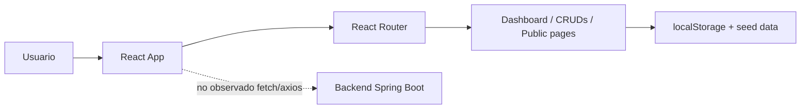

# Analisis tecnico separado - Frontend Econexus

Fecha de revision: 2026-05-29
Repositorio: `Econexus_Frontend`
Ruta revisada: `Econexus_Frontend/Econexus`
Rama objetivo: `develop`

## 1. Resumen ejecutivo

El frontend de Econexus es una aplicacion React/Vite con una experiencia visual avanzada para demostracion: incluye portal publico, login, layout privado, sidebar, topbar, dashboard, modulos CRUD, busqueda local, KPIs, tablas, modales y graficas. Como prototipo funcional esta bien encaminado.

La principal brecha arquitectonica es que no consume el backend. Toda la persistencia operativa se basa en `localStorage` y datos seed. Esto convierte la aplicacion en una maqueta local-first: util para presentar flujos y pantallas, pero insuficiente como sistema multiusuario, auditable, seguro o integrado.

Veredicto: frontend visualmente maduro para demo, pero tecnicamente pendiente de integracion API, autenticacion real, limpieza de lint y normalizacion de estado.

## 2. Stack y estructura

| Area | Tecnologia / Evidencia |
|---|---|
| Framework | React 19.2.4 |
| Build | Vite 8 |
| Ruteo | `react-router-dom` |
| Graficas | `recharts` |
| UI | Bootstrap 5.3.3 y Bootstrap Icons por CDN |
| Estado/persistencia | `useLocalStorage` + claves `eco_*` |
| Scripts | `dev`, `build`, `lint`, `preview` |

Estructura observada:

- `src/components`: modulos privados y compartidos.
- `src/pages/public`: paginas publicas.
- `src/data`: seeds/mock data.
- `src/hooks/useLocalStorage.js`: persistencia local reusable.
- `src/App.jsx`: ruteo publico/privado y control de autenticacion local.

## 3. Arquitectura actual

La arquitectura efectiva no tiene capa de servicios HTTP. El frontend opera como una SPA autocontenida con datos locales.

## 4. Hallazgos positivos

- Buena separacion visual por modulos: clientes, proveedores, ventas, usuarios, reportes, normativas y dashboard.
- Layout privado claro con Sidebar y TopBar.
- Existen componentes especializados para tablas, KPIs, modales de edicion y eliminacion.
- El portal publico tiene paginas separadas: inicio, nosotros, servicios, galeria y contacto.
- El build de produccion fue exitoso.
- La base de componentes facilita una migracion incremental hacia API real.
- El dashboard usa `recharts`, lo que da una base adecuada para visualizacion.

## 5. Hallazgos criticos

### P0 - Autenticacion y roles son manipulables

La autenticacion depende de:

- `eco_authenticated`
- `eco_current_user`
- usuarios seed en `eco_usuarios`

El control de roles se realiza en `ProtectedRoute` leyendo `localStorage`. Cualquier usuario puede editar esos valores desde DevTools.

Impacto: el frontend no puede considerarse seguro. El control de acceso real debe vivir en backend y el frontend solo debe adaptar la UI segun claims/roles recibidos.

### P0 - No hay integracion con backend

No se encontraron llamadas `fetch` ni `axios`. Los modulos usan `localStorage`, por ejemplo:

- Clientes: `eco_clientes_v2`
- Proveedores: `eco_proveedores_v2`
- Ventas: `eco_ventas_v2`
- Usuarios: `eco_usuarios`
- Reportes: `eco_reportes_v3`

Impacto: no hay persistencia central, concurrencia, auditoria, consistencia multiusuario ni validacion de negocio real.

### P1 - Estado local inconsistente

El dashboard usa claves distintas a los modulos principales:

| Modulo | Clave operativa | Clave usada por dashboard |
|---|---|---|
| Clientes | `eco_clientes_v2` | `eco_clientes` |
| Ventas | `eco_ventas_v2` | `eco_ventas` |
| Reportes | `eco_reportes_v3` | `eco_reportes` |

Impacto: los KPIs pueden mostrar informacion distinta a la que el usuario gestiona en las pantallas CRUD.

### P1 - Lint falla

`npm run lint` reporto 20 errores y 1 warning. Los problemas incluyen:

- variables no usadas;
- bloques `catch` vacios;
- JSX construido dentro de `try/catch`;
- `useMemo` condicional;
- llamadas sincrónicas a `setState` dentro de `useEffect` detectadas por reglas de React Hooks.

Impacto: deuda tecnica y riesgo de errores de renderizado, especialmente al crecer el proyecto.

### P2 - Bundle inicial grande

`npm run build` fue exitoso, pero Vite advirtio que el chunk principal supera 500 kB.

Impacto: carga inicial mas pesada y menor performance percibida.

### P2 - Dependencia de CDN para UI base

Bootstrap CSS, Bootstrap Icons y Bootstrap JS se cargan desde CDN en `index.html`.

Impacto: riesgo de disponibilidad externa y dificultad para aplicar CSP estricta.

## 6. Analisis por modulo

### Autenticacion

Funciona como demo local, pero no como autenticacion real. Debe migrarse a un flujo:

1. `POST /api/auth/login`.
2. Recepcion de JWT o token de sesion.
3. Guardado controlado del token.
4. Interceptor HTTP para `Authorization: Bearer`.
5. Cierre de sesion limpiando token y estado de usuario.

### Ruteo y autorizacion visual

El ruteo esta bien organizado, pero `ProtectedRoute` solo debe actuar como barrera de experiencia. La autorizacion real debe venir del backend.

### CRUDs locales

Los CRUDs son buenos prototipos de UX. El siguiente paso es sustituir `setLocalStorage` por servicios:

- `clientesService`
- `proveedoresService`
- `ordenesService`
- `reportesService`
- `usuariosService`
- `normativasService`

### Dashboard

Debe dejar de calcular metricas desde seeds/localStorage y consumir endpoints agregados del backend. Tambien debe usar las mismas fuentes que las pantallas operativas.

### Busqueda global

El TopBar implementa busqueda local multisource. Arquitectonicamente conviene migrarla a:

- busqueda local solo para datos cargados en pantalla; o
- endpoint `/api/busqueda?q=` para busqueda global real.

## 7. Riesgos

| Prioridad | Riesgo | Impacto |
|---|---|---|
| P0 | Roles editables desde navegador | Escalamiento de privilegios visual |
| P0 | Sin API real | No hay sistema integrado |
| P1 | Claves `localStorage` inconsistentes | Dashboard no confiable |
| P1 | Lint fallando | Deuda tecnica y bugs futuros |
| P2 | Bundle grande | Performance inicial afectada |
| P2 | CDN externo | Riesgo operativo/CSP |

## 8. Recomendaciones

### Corto plazo

- Corregir errores de lint.
- Normalizar claves `eco_*` mientras dure la etapa mock.
- Crear `src/services/apiClient.js`.
- Definir `VITE_API_BASE_URL`.
- Crear servicios por dominio.
- Migrar login a backend.

### Mediano plazo

- Migrar clientes/proveedores/ventas/reportes a API real.
- Usar un estado de sesion centralizado.
- Agregar manejo uniforme de loading/error/empty states.
- Implementar code splitting con rutas lazy.
- Mover Bootstrap e iconos a dependencias npm si se requiere control de build/CSP.

### Largo plazo

- Agregar pruebas con Vitest + React Testing Library.
- Agregar pruebas e2e de flujos criticos.
- Implementar observabilidad frontend: logging controlado, captura de errores y metricas basicas.

## 9. Roadmap sugerido

| Semana | Objetivo | Resultado esperado |
|---|---|---|
| 1 | Limpieza tecnica | Lint sin errores, claves consistentes, cliente HTTP base |
| 2 | Autenticacion real | Login conectado al backend y roles desde token |
| 3 | CRUDs core | Clientes, proveedores y ordenes conectados a API |
| 4 | Reportes/dashboard | Reportes, busqueda y KPIs desde backend |
| 5 | Calidad | Tests, code splitting y hardening de UX |

## 10. Criterios para considerar listo el frontend

- `npm run build` exitoso.
- `npm run lint` sin errores.
- Login consume backend real.
- Ningun modulo critico depende de `localStorage` como fuente primaria.
- Dashboard usa endpoints agregados o datos API consistentes.
- Rutas privadas dependen de estado autenticado real.
- Existe manejo de errores HTTP visible y consistente.
- Hay pruebas basicas para login, ruteo protegido y al menos un CRUD.

## 11. Conclusion

El frontend de Econexus cumple bien el rol de prototipo visual y funcional. La UI ya comunica el producto y los flujos principales. La prioridad ya no es agregar mas pantallas, sino conectar las existentes a una arquitectura real: API, autenticacion, contratos, manejo de errores y pruebas.
